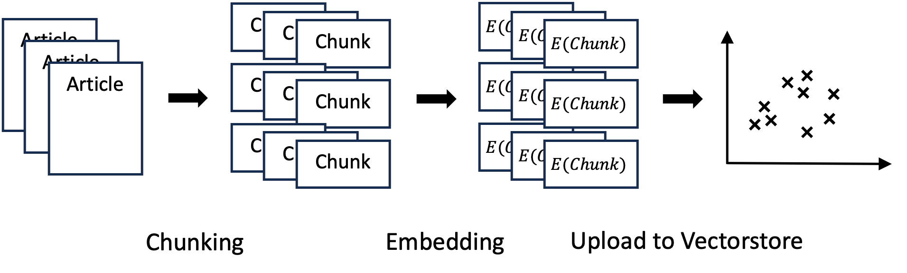
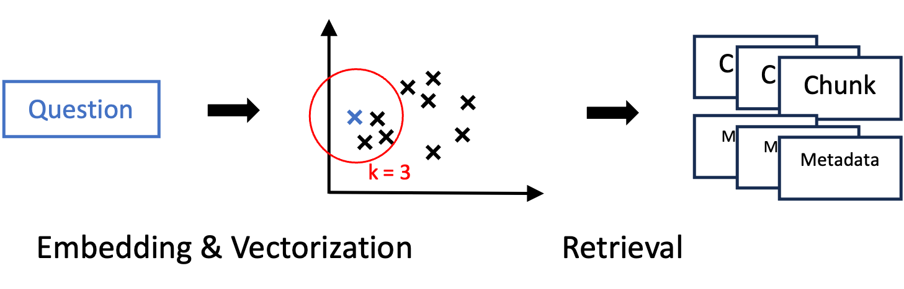
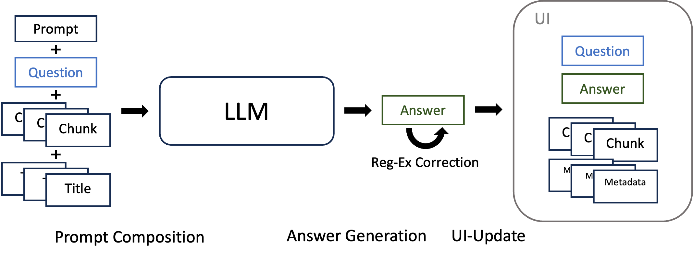

<a name="documentation"></a>


<a href='https://github.com/lukevoss/INLPT/commits/main'>
    
</a>


<!-- PROJECT LOGO -->
<br />
<div align="center">
  <a href="https://github.com/lukevoss/INLPT/Project">
    
  </a>

  <h2 align="center">MediSearch: Medical Question Answering</h2>

  <p align="center">
    An innovative project for answering medical questions.
    <br />
    <a href="https://github.com/lukevoss/INLPT"><strong>Explore the docs »</strong></a>
  </p>

  **Advisor:** Prof. Dr. Michael Gertz
  <br />
  <br />


  **Team Member:**

  | Name           | GitHub Username | Matriculation Number | Email                                  |
  |----------------|-----------------|----------------------|----------------------------------------|
  | Luke Voß       | lukevoss        | 4084927              | luke.voss@stud.uni-heidelberg.de       |
  | Finn-Henri Smidt | HenriSmidt    | 4084943              | finn.smidt@stud.uni-heidelberg.de      |
  | David Scheid   | davidscheid     | 3666910              | david.scheid@stud.uni-heidelberg.de    |
  | Keerthan Ugrani | keerthan-ugrani | 3770219            | keerthan.ugrani@stud.uni-heidelberg.de |
  
  \* All students are registered in the Master of Data and Computer Science program
  <br />
</div>

<!-- TABLE OF CONTENTS -->
<details>
  <summary>Table of Contents</summary>
  <ol>
    <li><a href="#anti-plagiarism-confirmation">Anti Plagiarism Confirmation</a></li>
    <li><a href="#member-contributions">Member Contributions</a></li>
    <li><a href="#introduction">Introduction</a></li>
    <li><a href="#related-work">Related Work</a></li>
    <li><a href="#methods-approach">Methods/Approach</a></li>
    <li>
      <a href="#experimental-setup-and-results">Experimental Setup and Results</a>
      <ul>
        <li><a href="data">Data</a></li>
        <li><a href="evaluation-method">Evalutation Method</a></li>
        <li><a href="experimental-details">Experimental Details</a></li>
        <li><a href="results">Results</a></li>
        <li><a href="analysis">Analysis</a></li>
      </ul>  
    </li>
    <li><a href="#conclusion-and-future-work">Conclusion and Future Work</a></li>
    <li><a href="#References">References</a></li>
  </ol>
</details>

## Anti-Plagiarism Confirmation
We hereby affirm that this project and the accompanying written report submitted are entirely our own original work. We confirm that:

1. All sources of information and data have been properly acknowledged and cited.
2. Direct quotations from books, journal articles, internet sources, and other projects have been clearly identified and properly attributed.
3. We have not copied or used the work of others as our own, except where clearly cited.

We understand that plagiarism is a serious offense that undermines the integrity of academic work, and we acknowledge the potential consequences that may arise from violating this commitment.

Luke Voß, Finn-Henri Smidt, David Scheid and Keertha Ugrani

Heidelberg, 01.03.2024

## Member Contribution


This section details the contributions made by each team member. For additional information, please refer to the Roadmap section in the README.md file.

### Luke Voß
* Readme file
* Logo Design
* Data Acquisition
* Data chunking
* Word Embedding and Vectorization
* Data Upload
* Pipeline Design
* Frontend development
* Implementation Baseline Model
* Meeting Notes
* Code Refactoring
* Writing: Introduction, Related Work, Data (in Results)

I managed and executed all issues surrounding the used datasets, encompassing acquisition, preprocessing, document segmentation, and embedding into the Weaviate cloud. My objective was to create a framework that facilitates straightforward assessment of various segmentation and embedding techniques for my teammates. Initially, I employed Elasticsearch for document retrieval, which proved inadequate for our needs. Following a milestone review, I explored suitable vector databases, ultimately selecting Weaviate, and subsequently developed a data uploading pipeline. From this point forward, I collaborated closely with Finn-Henri Smidt, and together we formulated and executed a pipeline design, establishing a functional baseline architecture. During that phase, our primary challenge was devising a strategy to utilize various Large Language Models (LLMs) without access to a GPU. We experimented with two methods, leveraging Google Colab and GPT-4ALL. Ultimately, we opted for Google Colab due to its minimal hardware requirements and straightforward setup process. We also crafted a frontend to enhance user experience. Throughout this process, I engaged in continuous code refactoring, aiming to remove redundant code, ensure readability, and maintain a modular code structure. This approach allowed for seamless integration and utilization by the entire team for their respective tasks. Together with Finn-Henri Smidt I also created most of the Readme file and the Logo while the Roadmap section was developed by all team members together. In the report, I authored the sections on [Introduction](#introdution), [Related Work](#related-work), and the [Data](#data) subsection within the Experimental Setup and Results section.


### Finn-Henri Smidt:
* Readme file contribution
* Pipeline Design
* Prompt engineering
* LLM Chain implementation
* Integrating Weaviate to LLM
* Integrate article citations to model output
* Frontend development
* Providing the Evaluation Code
* Creation of an Evaluation Dataset
* Writing:  Methods/Approach

My contributions to the project spanned across several key areas, primarily focusing on the implementation of the LLM  (Large Language Model) Chain. This involved integrating several components, such as the LLM itself, the Weaviate database, quantization, document retrieval mechanisms and the feature of citing retrieved documents within the model's output. Throughout this process, I faced two major challenges: a notable scarcity of comprehensive documentation and troubleshooting guides, likely due to the topic's novelty, and the slow pace of testing progress, hindered by our reliance on the limited availability of Colab GPUs.
Beyond the mere implementation of these components, my role also encompassed the thorough research and evaluation of available modules and language models. This phase included experimenting with different models and components following an initial selection process to identify the most relevant options for our project.  It involved implementing various options and fine-tuning components—adjusting model hyperparameters and prompts, for example—to thoroughly assess each component's strengths and weaknesses. This iterative process was again constrained by the challenges previously mentioned. 
In collaboration with Luke Voß, we later ventured to mitigate our dependency on Google Colab's resources by developing a version of the model capable of running locally. However, we ultimately decided against this approach due to the complex and lengthy installation process it imposed on new users.
Furtheremore, I provided the code for the evaltuation, as well as a small Evaluation Dataset, which was not used in the end.
Additionally, Luke and I worked together on the front-end development, striving to create an intuitive and efficient user interface for our project. Luke Voß and I took the lead in crafting the majority of the Readme file and the logo, while the Roadmap section was a collective effort by the entire team. In the report, I authored the sections on [Methods/Approach](#methods-approach). Lastly, a significant portion of my efforts was dedicated to maintaining the repository, ensuring that our project's codebase remained organized, up-to-date, and accessible to all team members and potential users.
  
### Keerthan Ugrani:

* Readme file contribution to Roadmap
* Evaluation dataset generation
* Evaluation metrics calculations
* Explore different chunking methods and sizes

My contribution to the project mainly focused on evaluation of the LLM (Large Language Model) chain. This involved generation of different types of questions the model can answer or handle correctly such as Confirmation [yes or no] type of questions, Factoid-type question [ what, which, when, who, how], List-Type questions, Causal questions, Hypothetical questions, Complex questions, Typos, reliability and also questions with scarcly available data. Where, each question type has more than 10 questions. Beyond the question generation I also worked on generating answers for each of the questions from other models such as gpt-3.5 and BERT for the calculations of evaluation metrics such as BLEU score, Rouge-1, Rouge-2, and Rouge-L. Additionally to check the performance of the model, performed different chunking methods in different sizes.

### David Scheid:
* Readme file contribution to Roadmap
* Experimental evaluation
* Optimizing the pipeline
* Testing different models
* Testing different chunks
* Uploading chunks to Weaviate

I mainly focused on the evaluation of the LLM. Herefore i mainly did experimental work with the finished chain, inlcuding different types of questions. The goal was to find issues in the answer generation that we can find improvements to our implementation. I precisely documented my results in the experiments.md file. I also focused on human-like behaviour of the chatbot, so the answers are not only correct in facts, but also seem like a natural communication.<br>
Then i checked different different models from Huggingface and tried to find the best model which also fits in the GPU memory of Google Colab. This inlcudes for example models from Meta or Mistral. I also played with different chunking sizes or the number of nearest chunks considered for the answer generation. The last parameter i varied was the embedding model.<br>
The main challenges i faced during my work was the loading time. Although we mainly worked with T4 GPU from Google Colab uploading of new data chunks to weaviate often took nearly an hour, if it worked on the first try, but often the process colapsed at minute 40. Also loading the different models and installing all the packages again was a big problem, which causes less models or variants tested in the end.  
I also worked on a deprecated version of the retriever, but because of miscommunication we did not use this one in the end. 


<!-- INTRODUCTION -->
## Introduction

The emergence of Large Language Models (LLMs) in recent years has spurred significant research into their application across diverse domains. Notably, the integration of LLMs with the field of medical research and healthcare information retrieval has garnered considerable attention due to its potential to enhance accessibility to medical knowledge ([Thirunavukarasu et al. 2023](#references)). 

MediSearch exemplifies this innovative convergence by leveraging advanced natural language processing (NLP) techniques and domain-specific knowledge bases, such as PubMed, to revolutionize how medical professionals, researchers, and the general public access and comprehend medical information (see [Relative Work](#relative-work) section). 
We employed a Retrieval-Augmented Generation (RAG) system (see [Retrieval](#retrieval) section) to navigate vast databases of medical literature, specifically focusing on PubMed abstracts published between 2013 and 2023. By prioritizing papers containing the term "intelligence" within their abstracts, our system possesses a unique capability to offer insights into the evolving landscape of artificial intelligence (AI) in medicine.
To facilitate efficient search query term matching and improved document retrieval, we stored our data within a vector database (see [Data Preparation](#data-preparation) section). Additionally, we leveraged the comparatively smaller and computationally efficient LLama 2 ([Touvron et al. 2023](#references)) model from Meta to construct a system requiring minimal computational resources (see [Answer Generation and Display](#answer-generation-and-display) section). This approach enables our system not only to locate pertinent information but also to present it in a readily understandable format. This ensures users receive concise, accurate, and contextually relevant answers.
Extensive testing has confirmed both the innovative nature and the resilience of our methodology. This comprehensive testing was instrumental in optimizing our pipeline design, ensuring the most effective utilization of available resources. (see [Experimental Setup and Results](#experimental-setup-and-results) section). The user interface integrates a citation style, which fosters further exploration and verification of the provided answers. This transparent answer-generation process fosters user trust by demystifying the previously opaque nature of pure text-generation models.
Our system aims to democratize access to medical knowledge by catering to diverse user groups:
- **Healthcare professionals:** It offers a rapid and reliable reference tool.
- **Researchers:** It serves as a gateway to the latest advancements in the field.
- **General public:** It provides a trustworthy source of medical information.

By harnessing the power of LLMs and NLP techniques, MediSearch offers a novel and efficient approach to accessing and comprehending medical information. This readily accessible platform empowers various stakeholders within the healthcare ecosystem to leverage its capabilities for improved decision-making and knowledge dissemination.

<!-- RELATED WORK -->
## Related Work

The field of natural language processing (NLP) has witnessed a surge in the development of powerful text-generation LLMs. While prominent models, like ChatGPT, raise concerns regarding data security and limited access, the open-source movement has gained traction. Projects like LaMDA by Google AI and models from organizations like Meta and Mistral offer downloadable models capable of eloquent text generation and response creation in local environments. These open-source models address data security concerns but still face challenges, including generating factually incorrect information (hallucinations), possessing outdated knowledge, and lacking transparent or traceable reasoning processes ([Gao et al. 2024](#references))

To address the limitations of LLMs, [Lewis et al. 2020](#references) introduced the concept of Retrieval-Augmented Generation (RAG). This framework combines the strengths of large language models with retrieval systems to improve the quality and relevance of generated text, particularly in knowledge-intensive tasks like question answering (QA) or information retrieval within a specific domain.

The performance of RAG systems is markedly enhanced through the integration with state-of-the-art embedding models like BERT and vector storage solutions such as Weaviate and Pinecone. These databases store rich, semantic text representations, enabling RAG systems to enhance retrieval processes and access diverse contextual information. The vectors act as connectors, linking retrieval to generation, thus improving the system's efficiency and the relevance of its outputs. This integration not only boosts the model's efficiency but also elevates its ability to generate more coherent, contextually relevant, and informative text outputs ([Gubkin 2024](#references))

Among the variety of applications, the integration of LLMs into the field of medical research and healthcare information retrieval has marked a significant stride towards enhancing accessibility to medical knowledge ([Thirunavukarasu et al. 2023](#references)). Traditionally, healthcare-focused QA and Information Retrieval systems primarily relied on NLP techniques for document retrieval. These methods often employed keyword-based or semantic searches and rule-based logic to answer questions ([Abacha et al. 2015](#references),[Lee et al. 2006](#references)). Although effective for basic queries, these traditional approaches struggle with complex questions and are limited in their ability to generate natural language responses, hindering scalability and overall flexibility.

The introduction of a healthcare-oriented RAG system, like MediSearch, marks a pioneering fusion of advanced NLP techniques with specialized knowledge repositories such as PubMed. This development enhances and streamlines the process of searching for research publications and providing research-based answers with cited sources, thereby revolutionizing the way healthcare information is accessed and utilized.


<!-- METHODS/APPROACH -->
## Methods/Approach

This section outlines the methodology used in developing the MediSearch RAG QA system. The methodology can be divided into three key stages:

### Data Preparation:

Chunking: PubMed articles are divided into smaller text chunks of 100 tokens each. An overlap of 50 tokens is maintained between consecutive chunks to capture contextual information across chunks.
Embedding: Following the chunking process, each discrete chunk is subjected to an embedding transformation using the pre-trained BAAI/bge-small-en-v1.5 model, as outlined by [Xiao et al.](#references) in 2023. This model, accessible via the Hugging Face repository, leverages advanced natural language processing techniques to map the textual information contained in each chunk into a high-dimensional vector space. The embedding process can be mathematically represented as follows:

$$
    v_i = E(chunk_i; Θ)
$$

where $v_i$ represents the dense vector corresponding to the $i$-th text chunk, $E()$ denotes the embedding function defined by the BAAI/bge-small-en-v1.5 model, $chunk_i$ is the input text chunk, and $Θ$ symbolizes the set of parameters (or weights) of the pre-trained model. This transformation effectively converts the textual information into a dense numerical vector of fixed size, capturing the semantic essence and meaning inherent in the text. 
Uploading: Finally, the vectorized chunks and their corresponding metadata, including titles and publication dates, are uploaded to the Weaviate vector store.




### Retrieval:

Nearest Neighbor Search: To facilitate the retrieval of relevant articles, the user's query is first embedded using the identical BAAI/bge-small-en-v1.5 model employed in the chunking and embedding process. This ensures that the question is transformed into a vector that resides in the same high-dimensional space as the article chunks. The mathematical representation of this embedding process for the user-question is similar to that of the text chunks, ensuring compatibility and comparability between the query and the documents in the vector space.
The embedded vector of the user's query is then utilized to conduct a Nearest Neighbor Search within the Weaviate vector store. This search algorithm identifies the three closest vectors (i.e., the most semantically similar article chunks) to the query vector, based on cosine similarity. These three vectors represent the chunks of articles that are most relevant to the user's query, providing a highly efficient and accurate mechanism for information retrieval.

Metadata Retrieval: Along with the retrieved three nearest neighbors (chunks), their corresponding metadata, including titles and publication dates, is also retrieved from the vector store.




### Answer Generation and Display:

Prompt Design: A meticulously crafted prompt is employed for the Large Language Model (LLM), integrating the user's query, the retrieved document snippets, and their respective titles. Given the LLM's limited capacity, the prompt template places significant emphasis on citations, while ensuring brevity. Additionally, to avoid exceeding the model's capacity, only a limited number of short documents are provided.
LLM Processing: The LLM used is the meta-llama/Llama-2-13b-chat-hf by [Touvron et al. 2023](#references), which receives the formatted prompt, including the question, chunks, and titles, and generates an answer based on the information provided. The employed model underwent quantization through [BitsandBytes](https://github.com/TimDettmers/bitsandbytes). Specifically, the data type was transformed from float32 to a normalized float4 format, accommodating 4 bits of information. Subsequently, a secondary quantization step resulted in a further reduction of 0.4 bits per parameter.
Answer Display: The generated answer from the LLM, along with the retrieved chunks and their metadata (titles, publication dates), are displayed in the user interface. This provides users with relevant information from PubMed articles along with the LLM's generated answer, allowing them to further explore the retrieved data. Furthermore, upon recognizing instances where the model tends to generate responses resembling converstions, regular expression functions were implemented on the output to mitigate such errors.




This methodology utilizes Weaviate for efficient storage and retrieval of vectorized chunks, enabling fast and reliable information retrieval for responding to user queries. By leveraging pre-trained language models, the system provides informative answers to medical-related questions based on relevant and retrieved information from PubMed articles.


<!-- EXPERIMENTAL SETUP AND RESULTS -->
## Experimental Setup and Results

### Data
To generate the dataset, the Entrez Direct library was utilized for accessing and downloading Pubmed articles. The command line prompt used for this purpose is as follows:
```sh
    esearch -db pubmed -query "intelligence [TIAB]" -datetype PDAT -mindate 2013/01/01 -maxdate 2023/12/31 | efetch -format xml > data.xml
```

This command filtered articles published between January 1, 2013, and December 31, 2023, containing the word ‘intelligence’. The output was saved in a file named `data.xml` in the current working directory.

A custom XML Parser class was developed to parse the `data.xml` file into a more concise and relevant JSON format. The dataset primarily contained two types of articles: Book articles and journal articles, each requiring specific parsing rules. The following fields were extracted from the XML file:

| Field      | Article                                      | Book Article                                 |
|------------|----------------------------------------------|----------------------------------------------|
| **Pmid**       | PubMed internal ID, used for indexing within the PubMed database.  | "" |
| **Title**      | The title of the article.                    | The title of the book article.               |
| **Authors**    | A list of article authors.                   | A list of book authors and article authors.  |
| **Date**       | The publication date in the format YYYY-MM-DD, as specified in the XML file. | "" |
| **Journal**    | The name of the journal where the article was published. | Null  |
| **Abstract**   | The abstract text, continuous without section breaks. | "" |

To leverage the information contained in text sections, we inserted two newline characters (`/n/n `) at the end of each abstract section before we appended the text section. This formatting aids the Recursive Text Splitter in identifying and chunking the different sections of the abstract more effectively.

During the data processing phase, it was observed that approximately 8,600 out of 63,279 documents did not contain the keyword ‘intelligence’ in either the title or abstract. Additionally, some articles had publication dates outside the specified timeframe. Further investigation suggested that the former issue could be attributed to anomalies within the PubMed library, while the latter likely resulted from discrepancies in stored publication dates, with PubMed defaulting to the most recent date. These inaccuracies were corrected through manual data entry filtering.
In the final step, the data was chunked and embedded into Weaviate according to the [data preparation](#data-preparation) section 

### Evaluation Method

This Comprehensive evaluation methodology analyzes the performance of the large language model to answer to the many type of questions asked by the user. Utilization of the renowed GPT-3.5 for generating different types of questions such as Confirmation, Factoid, List, Causal, Hypothetical, Complex questions, Typos, reliability, and questions with scarce data availability. 

#### Question Generation using GPT-3.5
* Utilizing versatile capability of GPT-3.5 we generated different types of questions as mentioned above from our dataset.
* The model was tasked to generate multiple questions across different topics of the dataset provided

#### Answer generation using GPT-3.5
* Following the question generation phase, GPT-3.5 was employed to generate answers corresponding to each question type.
* The aim was to evaluate the model's proficiency in comprehending and responding accurately to diverse question types.

#### Answer Generation using our LLM Model
* Here I utilized our model to generate answers and also to provide the source or the reference from which the answer was generated by the model.
* The reference documents contains all the data such as authors, reference snippets and title of the document.
* Our model's performance was analyzed in generating responses across different type of questions.

#### Metrics Computation
* Standard evaluation metrics including BLEU, ROUGE-1, ROUGE-2, and ROUGE-L were computed to quantitatively assess the quality and similarity of generated answers to reference answers
* These metrics facilitated a comprehensive evaluation of the models' performance across various question types

#### Manual Evaluation
* In addition to automated metrics, a manual evaluation was conducted by human annotations to provide qualitative insights into the generated answers.
* Annotations evaluated the responses based on criteria such as accuracy, coherence, relevance, and handling of different question types.

### Experimental Details

1. Question and answer generation
   * Confirmation Questions: Both GPT-3.5 and the custom LLM effectively handled yes/no type questions, providing accurate responses.
   * Factoid-Type Questions: Both models demonstrated proficiency in generating and answering fact-based questions (e.g., what, which, when, who, how).
   * List-Type Questions: The models successfully generated and answered questions requiring list-based responses.
   * Causal Questions: GPT-3.5 and the custom LLM exhibited competence in generating and responding to causal questions, providing logical explanations.
   * Hypothetical Questions: Both models effectively handled hypothetical scenarios, generating plausible responses.
   * Complex Questions: The models demonstrated the ability to comprehend and respond to complex questions, albeit with varying degrees of accuracy and coherence.
   * Typos and Reliability: GPT-3.5 and the custom LLM exhibited robustness in handling typos and maintaining reliability in generating accurate responses.
   * Scarce Data Availability: Despite limited data availability, both models generated responses that were contextually relevant and coherent, leveraging available information effectively.

2. Metric Evaluation
   * BLEU, ROUGE-1, ROUGE-2, and ROUGE-L scores indicated a significant overlap and similarity between the generated answers and reference answers across diverse question types.
   * The custom LLM model showcased competitive performance, particularly in terms of ROUGE scores, reflecting improved response quality and specificity compared to GPT-3.5.

3. Manual Evaluation
   * Human analysis provided positive assessments for the LLM model, acknowledging the accuracy and relevance of the generated answers across different question types.
   * The LLM chain receives relatively good ratings for providing more precise and contextually appropriate responses, especially in handling complex questions and scarce data scenarios.

### Results

Based on the Evaluation metrics:
1. BLEU Score
   * The BLEU score measures the overlap between the generated answers and reference answers, focusing on n-grams.
   * A score of 0.519 indicates a relatively high level of overlap, suggesting that the generated answers may not align closely with the reference answers in terms of n-gram similarity.
   * This could imply that while the generated answers may contain some similar phrases or words to the reference answers, they may lack in capturing the full context or essence of the reference answers.

2. ROUGE-1 Score
   * The ROUGE-1 score evaluates the overlap of unigram (single words) between the generated answers and reference answers.
   * A score of 0.2302 indicates a moderate level of overlap in terms of single words between the generated and reference answers.
   * This suggests that the generated answers capture some of the key words present in the reference answers, but there may still be room for improvement in terms of capturing the overall content and meaning

3. ROUGE-2 Score
   * The ROUGE-2 score measures the overlap of bigrams (pairs of adjacent words) between the generated answers and reference answers.
   * A score of 0.0833 indicates a relatively low level of overlap in terms of adjacent word pairs between the generated and reference answers.
   * This suggests that the generated answers may not effectively capture the sequential relationship between words present in the reference answers, leading to a lower score in this metric.
     
4. ROUGE-L Score
   * The ROUGE-L score assesses the longest common subsequence (LCS) between the generated answers and reference answers, emphasizing recall.
   * A score of 0.2093 indicates a moderate level of overlap in terms of the longest common subsequence between the generated and reference answers.
   * This suggests that while the generated answers may contain some parts that match with the reference answers, there may be discrepancies in terms of capturing the overall structure and coherence.

### Analysis

* The provided evaluation metrics indicate that while there is some level of overlap between the generated answers and reference answers, there is room for improvement in terms of capturing the full context, meaning, and sequential relationship between words.
* Further refinement of the language model, possibly through additional training data or fine-tuning, may be necessary to enhance the quality and coherence of the generated answers. Additionally, exploring other evaluation metrics or techniques could provide further insights into the model's performance and areas for improvement.
* Different LLM models were tested (Llama 2 13b, Mistral 7b, Bloom 7b). Mistral 7b had the best outcome. The answers look human-like and natural. The answers are precise and fit to the question type. Mistral doesn't contain citing which was a major goal, so wie did not use this

<!-- CONCLUSION AND FUTURE WORK -->
## Conclusion and Future Work

The evaluation project underscores the effectiveness of both GPT-3.5 and custom-trained LLM models in generating and handling diverse question types, including Confirmation, Factoid, List, Causal, Hypothetical, Complex questions, Typos, reliability, and scenarios with scarce data availability. While GPT-3.5 demonstrated commendable performance, the custom LLM exhibited notable improvements in specificity, relevance, and handling of complex queries, as evidenced by both automated metrics and manual evaluation. These findings highlight the potential of custom training to enhance the performance of language models for domain-specific tasks and underscore avenues for further refinement and optimization in future applications.

#### Future Scope and Improvements:
* Augmenting the training data with diverse examples can also enhance the model's understanding of different contexts and improve its ability to generate accurate answers.
* Implementing ensemble models by combining multiple language models can potentially improve the overall performance and robustness of the system. Ensemble methods can help mitigate individual model biases and errors, leading to more reliable and accurate answers.
* Metrics that capture semantic similarity, coherence, and relevance to the context can complement traditional metrics like BLEU and ROUGE scores.
* Integrating human-in-the-loop evaluation mechanisms can provide valuable feedback and validation of the generated answers
* Leveraging transfer learning techniques, such as pre-training on large-scale datasets followed by fine-tuning on domain-specific data, can enhance the model's ability to generalize across different tasks and domains.
* with better GPU bigger LLM models could be used, which should lead to better outcome


By incorporating these future scope and improvement strategies, the analysis of question and answer generation can be enhanced, leading to more accurate, reliable, and contextually relevant outputs

<!-- REFERENCES -->
## References

- Asma Ben Abacha and Pierre Zweigenbaum. "MEANS: A Medical Question-Answering System Combining NLP Techniques and Semantic Web Technologies". *Information Processing & Management*, 51(5): 570-594, September 2015. DOI: [10.1016/j.ipm.2015.04.006](https://doi.org/10.1016/j.ipm.2015.04.006). [https://www.sciencedirect.com/science/article/pii/S0306457315000515](https://www.sciencedirect.com/science/article/pii/S0306457315000515).

- Gubkin Alon. "Introduction to RAGs: Real-world Applications and Examples". *Aporia*. 2024. [https://www.aporia.com/learn/introduction-to-rags-examples-from-the-real-world/](https://www.aporia.com/learn/introduction-to-rags-examples-from-the-real-world/).

- Patrick Lewis, Ethan Perez, Aleksandra Piktus, Fabio Petroni, Vladimir Karpukhin, Naman Goyal, Heinrich Küttler, Mike Lewis, Wen-tau Yih, Tim Rocktäschel, Sebastian Riedel, Douwe Kiela. "Retrieval-Augmented Generation for Knowledge-Intensive NLP Tasks". *arXiv*, April 12, 2021. DOI: [10.48550/arXiv.2005.11401](https://doi.org/10.48550/arXiv.2005.11401). [http://arxiv.org/abs/2005.11401](http://arxiv.org/abs/2005.11401).

- Yunfan Gao, Yun Xiong, Xinyu Gao, Kangxiang Jia, Jinliu Pan, Yuxi Bi, Yi Dai, Jiawei Sun, Qianyu Guo, Meng Wang, Haofen Wang. "Retrieval-Augmented Generation for Large Language Models: A Survey". *arXiv*, January 4, 2024. DOI: [10.48550/arXiv.2312.10997](https://doi.org/10.48550/arXiv.2312.10997). [http://arxiv.org/abs/2312.10997](http://arxiv.org/abs/2312.10997).

- Minsuk Lee, James Cimino, Hai Ran Zhu, Carl Sable, Vijay Shanker, John Ely, Hong Yu. "Beyond Information Retrieval—Medical Question Answering". *AMIA Annual Symposium Proceedings*, 2006: 469-473. [https://www.ncbi.nlm.nih.gov/pmc/articles/PMC1839371/](https://www.ncbi.nlm.nih.gov/pmc/articles/PMC1839371/).

- Arun James Thirunavukarasu, Darren Shu Jeng Ting, Kabilan Elangovan, Laura Gutierrez, Ting Fang Tan, Daniel Shu Wei Ting. "Large Language Models in Medicine". *Nature Medicine*, 29(8): 1930-1940, August 2023. Nature Publishing Group. DOI: [10.1038/s41591-023-02448-8](https://doi.org/10.1038/s41591-023-02448-8). [https://www.nature.com/articles/s41591-023-02448-8](https://www.nature.com/articles/s41591-023-02448-8).

- Shitao Xiao, Zheng Liu, Peitian Zhang, Niklas Muennighoff. "C-Pack: Packaged Resources To Advance General Chinese Embedding". 2023. [https://arxiv.org/abs/2309.07597](https://arxiv.org/abs/2309.07597).

- Hugo Touvron, Louis Martin, Kevin Stone, Peter Albert, Amjad Almahairi, Yasmine Babaei, Nikolay Bashlykov, Soumya Batra, Prajjwal Bhargava, Shruti Bhosale, Dan Bikel, Lukas Blecher, Cristian Canton Ferrer, Moya Chen, Guillem Cucurull, David Esiobu, Jude Fernandes, Jeremy Fu, Wenyin Fu, Brian Fuller, Cynthia Gao, Vedanuj Goswami, Naman Goyal, Anthony Hartshorn, Saghar Hosseini, Rui Hou, Hakan Inan, Marcin Kardas, Viktor Kerkez, Madian Khabsa, Isabel Kloumann, Artem Korenev, Punit Singh Koura, Marie-Anne Lachaux, Thibaut Lavril, Jenya Lee, Diana Liskovich, Yinghai Lu, Yuning Mao, Xavier Martinet, Todor Mihaylov, Pushkar Mishra, Igor Molybog, Yixin Nie, Andrew Poulton, Jeremy Reizenstein, Rashi Rungta, Kalyan Saladi, Alan Schelten, Ruan Silva, Eric Michael Smith, Ranjan Subramanian, Xiaoqing Ellen Tan, Binh Tang, Ross Taylor, Adina Williams, Jian Xiang Kuan, Puxin Xu, Zheng Yan, Iliyan Zarov, Yuchen Zhang, Angela Fan, Melanie Kambadur, Sharan Narang, Aurelien Rodriguez, Robert Stojnic, Sergey Edunov, Thomas Scialom. "Llama 2: Open Foundation and Fine-Tuned Chat Models". *arXiv*, July 19, 2023. DOI: [10.48550/arXiv.2307.09288](https://doi.org/10.48550/arXiv.2307.09288). [http://arxiv.org/abs/2307.09288](http://arxiv.org/abs/2307.09288).


